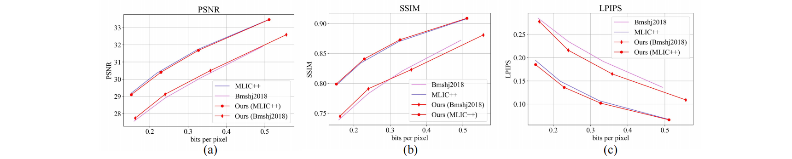

# Unified Coding for Both Human Perception and Generalized Machine Analytics with CLIP Supervision（UG-ICM）
This repo contains the official PyTorch implementation for the paper “Unified Coding for Both Human Perception and Generalized Machine Analytics with CLIP Supervision”.

## Updates

#### 2024/12/13 
The training script is about to be open-sourced. 

#### 2024/12/10 
*Unified Coding for Both Human Perception and Generalized Machine Analytics with CLIP Supervision(UG-ICM)* is accepted at **AAAI 2025**!


## Abstract
The image compression model has long struggled with adaptability and generalization, as the decoded bitstream typically serves only human or machine needs and fails to preserve information for unseen visual tasks. Therefore, this paper innovatively introduces supervision obtained from multimodal pre-training models and incorporates adaptive multi-objective optimization tailored to support both human visual perception and machine vision simultaneously with a single bitstream, denoted as Unified and Generalized Image Coding for Machine (UG-ICM). Specifically, to get rid of the reliance between compression models with downstream task supervision, we introduce Contrastive Language-Image Pre-training(CLIP) models into the training constraint for improved generalization. Global-to-instance-wise CLIP supervision is applied to help obtain hierarchical semantics that make models more generalizable for the tasks relying on the information of different granularity. Furthermore, for supporting both human and machine visions with only a unifying bitstream, we incorporate a conditional decoding strategy that takes as conditions human or machine preferences, enabling the bitstream to be decoded into different versions for corresponding preferences. As such, our proposed UG-ICM is fully trained in a self-supervised manner, i.e., without awareness of any specific downstream models and tasks. The extensive experiments have shown that the proposed UG-ICM is capable of achieving remarkable improvements in various unseen machine analytics tasks, while simultaneously providing perceptually satisfying images.




## Environment

Pytorch 3.7.16

CompressAI 1.2.0b3

Pytorch 1.13.0

## Weights

<div class="center">
 
|  | Link |
|:--------:|:--------:|
| 1 |   [MEDA](https://mega.nz/file/ID1CTDjb#a_McAQeXL3bLshinCvcOU4_pGI3omTJrphhSkjJpApE) |
| 2 |   [MEDA](https://mega.nz/file/EaEAybJZ#KJX2oy1rAMILaRcRcTm7O8Xjq7oKdrQExKMqg970O6w) |
| 3 |   [MEDA](https://mega.nz/file/EOkjiLaJ#QLvKceVUCG6TKlrw2KmcTpAhk4dNmvUmftY1N3lAN4c) |
| 4 |   [MEDA](https://mega.nz/file/VD8XjBgb#qqyMYZWLiI3r2g0-yX7jKPHGO1Z1D6SfBC-IfQIpsks) |
 
</div>

<div class="center">
 
|  | Link |
|:--------:|
| 1 |  .[BaiDu Drive]https://pan.baidu.com/s/1bEcDDbiSIPj67yVrUt6tGQ?pwd=5doz |


</div>

## Testing:

### Compress:
Encode and compress the test images, and obtain the decoded images for human and the decoded images for machine from the unified bitstreams.
```python
cd tests

python test.py -exp test --gpu_id 0  -c /path/to/checkpoint -d /path/to/dataset
```

### Classification:
#### Dataset: ImageNet-1k

The performance of decoded images for classification task (modify the decoded image path in `test.py`).
```python
cd classification

python test.py
```

### Instance segmantation:
#### Dataset: COCO2017_val

The performance of decoded images for instance segmantation task (modify the decoded image path in `test.py`).
```python
cd instance segmantation

python test.py
```

## License

[MIT License](https://opensource.org/licenses/MIT)

## Acknowledgments
Thanks [Compressai](https://github.com/InterDigitalInc/CompressAI), [MLIC](https://github.com/JiangWeibeta/MLIC), [CLIP](https://github.com/openai/CLIP), [TransTIC](https://github.com/NYCU-MAPL/TransTIC) for their public code and released models.


